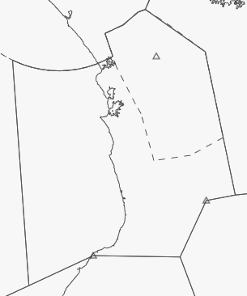

--8<-- "includes/abbreviations.md"

!!! warning "Event Only Position"
    RAN is designated as an Event Only Position, and may only be staffed during a VATNZ event where approved, or if explicitly authorised by the Operations Director.

    **Note** that this also includes the use of the RAN primary frequency of 126.000 MHz. This frequency is not available to be used for Controllers to provide an Extended Enroute service. The primary frequency of OCR provides more than enough coverage in the Auckland area.

## Positions

| Sector Name               | Shortcode | Callsign         | Frequency | Login ID   |
| ------------------------- | --------- | ---------------- | --------- | ---------- |
| Auckland Control (Raglan) | RAN       | Auckland Control | 126.000   | NZAA-R_CTR |

## Airspace

RAN covers all airspace within the lateral bounds as found below, with the only exception being the airspace that has been delegated to HN TMA. The lower limit for RAN airspace is `A065`, except overhead HN TMA, where the lower limit is `A110`.

When NP TWR is offline, RAN automatically inherits the TWR and Procedural Approach services provided by NP TWR. See [the responsibilities section on NP TWR](#np-twr).

<figure markdown> 
  
  <figcaption>Raglan's Lateral Bounds</figcaption>
</figure>

## Sector Responsibilities

RAN is responsible for sequencing and descent management into NZAA, in addition to departure and climb management of departures out of NZAA.

RAN manages the traffic into and out of the HN TMA to the South, and is responsible for the sequence into the TMA.

RAN is also responsible for the integration of OHA traffic into the NZAA arrival sequence.

### STAR Assignment

RAN shall assign STARs to any aircraft that have their destination within either NAK or OHA. 

### AA TMA

RAN shall ensure that an efficient arrival flow is maintained into AA TMA. 

### NP TWR

When NP TWR is offline, RAN is responsible for all functions of NP TWR, including the Procedural Tower service. 

When responsible for NP TWR, RAN may opt to provide a radar approach service, rather than a procedural approach service. 

## Coordination

### NAK

RAN shall assign STARs to any aircraft where the destination is within the lateral bounds of NAK without coordination.

RAN shall assign STARs to any aircraft bound for NZWN without coordination, provided it is for the nominated runway and approach type as stated in the ATIS. A request for use of a non-nominated approach requires coordination from NAK, who will liaise with WN TMA and ADC.

RAN shall ensure that any aircraft crossing the RAN/NAK boundary is established on an airway. RAN may clear aircraft direct to a boundary fix, provided it is established on an airway once it reaches the direct-to fix.

### AA TMA

RAN shall ensure that aircraft crossing into AA TMA via the `PEPPE`, `DAVEE`, `SCARY` or `SKEPY` feeder fixes conform to the following conditions:

  - Aircraft are seperated no less than 5nm in trail, with no closure,
  - Aircraft enter the TMA overhead the feeder fix unless previously coordinated.

RAN may re-clear any aircraft on a short STAR to a long STAR without coordination, however **not** the other way around.

RAN may descend aircraft no lower than `A110` without coordination from AA TMA. The only exception being for NZAR bound aircraft, where they may be descended to `A060` with an awareness coordination message.

RAN may clear aircraft direct to the STAR's AA TMA boundary fix without coordination, provided that they have been cleared to rejoin the STAR at that point. Aircraft may be cleared to track direct to a fix within AA TMA's boundary with co-ordination, subject to the same condition.

### HN TMA

Due to the relatively small lateral boundaries of HN TMA, RAN shall ensure that any aircraft descending into NZHN are a standard 5nm spacing, preferably greater.

RAN may descend aircraft bound for NZHN to `A080` without coordination from HN TMA, and may descend lower than this with coordination.