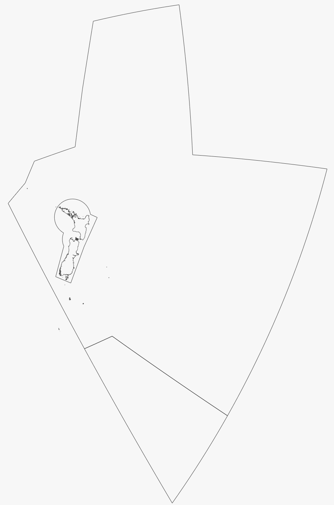
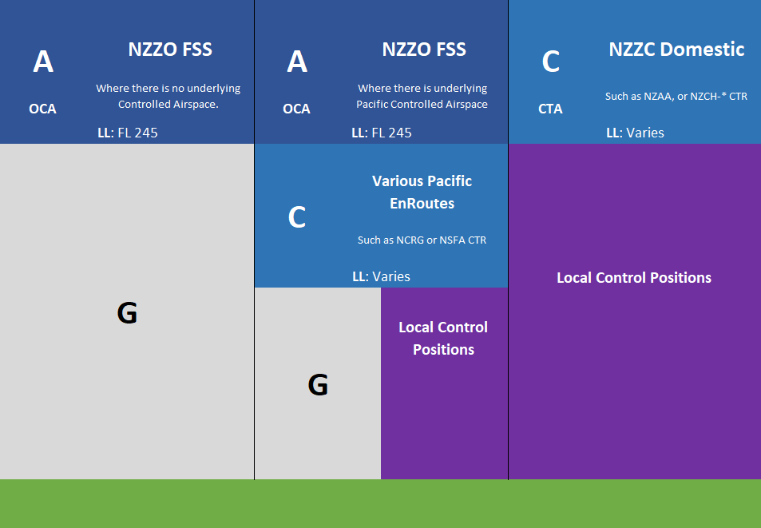

--8<-- "includes/abbreviations.md"

Auckland Radio is an Oceanic Control station that covers the entirety of the NZZO FIR, except where intersected by the NZZC and NZCM FIRs. In the real-world, radar coverage over this large area over the ocean is not possible - therefore "non-radar" procedures are used to ensure the separation of aircraft.

## Positions

There are two approved positions that can be staffed within the NZZO FIR. 

| Callsign   | Position Name         | RTF Designator | Frequency                    | Notes               |
| ---------- | --------------------- | -------------- | ---------------------------- | ------------------- |
| NZZO_FSS   | Auckland Radio        | Auckland Radio | 8.867 (VHF alias 129.00MHz)  |                     |
| NZZO-E_FSS | Auckland Radio - East | Auckland Radio | 5.643 (VHF alias 131.500MHz) | Event Only Position |
| NZCM_FSS   | MacMurdo Center       | Mac Center     | 9.032 (VHF alias 128.700MHz) |                     |

## Airspace Overview

{ align=right width="40%"}

An overview of Auckland Radio's airspace can be seen to the right. The NZZO FIR borders the following FIRs:

  - **West:** Brisbane Radio - Indian South, Tasman and Lord Howe Island sectors.
  - **North West**: Nadi Oceanic
  - **North**: Oakland Oceanic
  - **North-East**: Tahiti Oceanic
  - **East**: Pascula
  - **South**: MacMurdo Center

It is important to note that NZZO **does not** provide coverage over, or within the NZZC FIR.

Below is an overview of the various classes of airspace that can be found within the NZZO. 

<figure markdown> 
  { width="100%" }
</figure>

