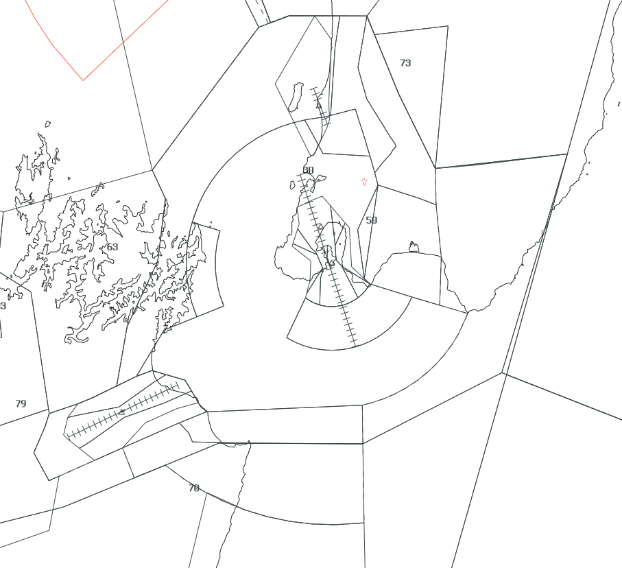

--8<-- "includes/abbreviations.md"

!!! note "Wellington Procedures"
    The WTMA procedures build upon information already contained in the [NZWN Aerodrome Procedures](../aerodromes/Class-C/nzwn.md), and any Controller logged on to WTMA should be familiar with those procedures.

## Positions

| Position Name   | Shortcode | Callsign            | Frequency | Login ID | Usage     |
| --------------- | --------- | ------------------- | --------- | -------- | --------- |
| Wellington TMA  | WTMA      | Wellington Approach | 119.300   | NZWN_APP | Primary   |

### Event Only Positions

!!! Danger
    The following are designated as Event Only positions, and may only be staffed during a VATNZ event where approved, or if explicitly authorised by the Operations Director.

| Position Name             | Shortcode | Callsign            | Frequency | Login ID | Usage                       |
| ------------------------- | --------- | ------------------- | --------- | -------- | --------------------------- |
| Wellington Terminal Radar | WDEP      | Wellington Approach | 122.300   | NZWN_DEP | Events - Traffic Management |

## Airspace

Wellington CTA/C follows the lateral and vertical boundaries as shown below. As WTMA has an unlimited vertical bound, aircraft transiting within the lateral bounds of the airspace shown below shall still be handed to WTMA.

<figure markdown>
   
  <figcaption>Wellington TMA (CTA/C)</figcaption>
</figure>

### Transfer of Control Points

|Transfer Flow         | Requirements                                                  | Notes                                                                       | 
| -------------------- | ------------------------------------------------------------- | --------------------------------------------------------------------------- | 
| Tower -> Approach    | Once the aircraft becomes airborne off the runway             | Tower shall instruct all aircraft to contact WTMA airborne                  |
| Approach -> Control  | Once the aircraft are approaching the lateral bounds          | Aircraft may be handed off when nothing further is required of the aircraft | 
| Control -> Approach  | Once the aircraft is approaching the cleared level by control | Aircraft may not always be cleared to A110 when handed to WTMA              | 
| Approach -> Tower    | Once established on final (ILS/LOC) or over the IAF (RNP)     |                                                                             |

## Departures

Departures will be assigned by Wellington Controllers in accordance with the [SID Assignment guide](../aerodromes/Class-C/nzwn.md#sid-assignment). 

WTMA may climb departing aircraft as necessary to maintain separation and traffic flow up to their requested flight level. International aircraft shall be instructed to climb to `FL250`, if further climb is requested, they shall be handed to NAK.

For terrain clearance purposes any track shortening shall be done above `A025` to keep aircraft clear of associated terrain, **unless** the aircraft is departing from RWY 16 to the South where WTMA may take the aircraft off the SID above `A005`. 

!!! Note
    When the duty runway is runway `34` - in low levels of traffic or to suit the sequence WTMA may turn aircraft departing to the south through the harbour (eg `H180`).

### Track Shortening SIDs

Aircraft under the jurisdiction of WTMA may be track-shortened or assigned a heading to assist with sequencing or for separation. 

WTMA may track-shorten where practical within their sector. Anything outside of thier sector must be coordinated with the appropriate sector.

### Short-Sector STARs

Refer to [Short Sector STARs](../aerodromes/Class-C/nzwn.md#star-clearance-for-nzns--nzwb)

## Arrivals 

NAK, OHA or KAI will hand aircraft to WTMA no lower than `A110`, unless co-ordinated.

### Track Shortening STARs

WTMA should make use of track-shortening on STARs to allow for an efficient sequence to be applied.

## Woodbourne Procedures

WTMA will issue the appropriate STAR into WB unless already issued, and will descend aircraft and clear them for the nominated approach, once established inbound WTMA will hand aircraft to WB Tower

When Woodborne Tower is offline WTMA will provide top down services. 

## Paraparaumu Procedures

When Paraparaumu Flight Service on watch, any IFR departures shall be co-ordinated. As Paraparaumu is only a Flight Service, WTMA shall issue the clearance to Flight Service and they shall pass it onto the aircraft. And aircraft will be instructed to `Passing 2,500ft Contact Wellington 119.3` this shall be done during on vailidation of the clearance.

When Paraparaumu Flight Service offine WTMA shall issue that clearance as per a normal Uncontrolled IFR clearance

## Uncontrolled IFR 

For Uncontrolled IFR aircraft leaving the WTMA Control Area, WTMA shall issue the appropriate STAR for that aerodrome, and clear the aircraft to leave Controlled Airspace on descent. 

If the aircraft is terminating underneath the WTMA Control Area, they shall be instructed to contact you on the ground to cancel their IFR flight plan. If their flight is terminating underneath another sector, such as OHA, they shall be instructed to contact that sector to terminate their FPL. This shall be co-ordinated with the appropriate sector.

## Palmerston North, Ohakea and Whanganui Arrivals

WTMA shall ensure that a STAR clearance has been issued by KAI for aircraft bound for PM and OH. WTMA may also descend aircraft bound for OH, PM, WU to A110 without coordination. 

## Coordination

### Wellington/Woodbourne Tower

WTMA shall coordinate with Wellington and Woodbourne Tower on any requested approach that is not nominated in the ATIS's.

### NAK, OHA/OTMA and KAI

WTMA shall coordinate any track shortening outside of their control area. 
